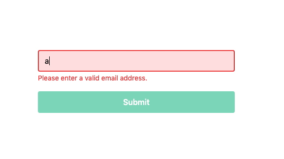
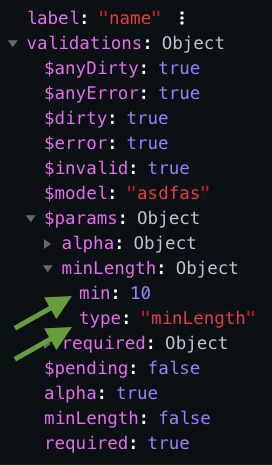

# Vuelidate Form Group

[](https://app.codeship.com/projects/378002)


A Vue Form Group component plugin for [Vuelidate](https://vuelidate.js.org/)

This plugin provides a renderless component which, when using Vuelidate, validates and compiles (with value interpolation) error messages for individual form inputs. This plugin is a direct result of my findings while writing [Vuelidate: Effortless Error Messaging
](https://crishell.co/articles/vuelidate--effortless-error-messaging/).

Check out the [demo](https://vuetify-form-group.netlify.app/)



- [Install](#install)
  * [Options](#options)
- [Form Group Component](#form-group-component)
  * [Props](#props)
  * [Slot Scope (default)](#slot-scope--default-)
  * [Usage](#usage)
- [Interpolation/Compilation of Error Messages](#interpolation-compilation-of-error-messages)
  * [Example](#example)
  * [Additional Values for Interpolation/Compilation](#additional-values-for-interpolation-compilation)
- [Scripts](#scripts)
- [How to Contribute](#how-to-contribute)
  * [Pull Requests](#pull-requests)
- [License](#license)


## Install

```bash
yarn add -D vuelidate-form-group
# or
npm i -D vuelidate-form-group
```

```javascript
import Vue from 'vue';
import VuelidateFormGroup from 'vuelidate-form-group';

const options = {
  /**
   * Defining these templates is critical to get the most out of this plugin. Be sure to define templates
   * for every Vuelidate validator you're using. A good place to start is to define
   * templates for all built-in Vuelidate validators found here:
   * https://vuelidate.js.org/#sub-builtin-validators
   *
   * If you forgo this step, you can still style your form elements
   * using the invalid slot scope. However, crucial
   * user context will be missing.
   */
  templates: {
    alpha: 'Alphanumeric characters only.',
    email: 'Please enter a valid email address.',
    minLength: 'Please enter a {label} with a length no less than {min}.',
    required: 'Please enter your {label}.'
  }
}

Vue.use(VuelidateFormGroup, options);
```

### Options
| Name               | Description                                                                                       | Default                     |
|--------------------|---------------------------------------------------------------------------------------------------|-----------------------------|
| `componentName`    | The name of the globally registered Form Group component                                          | `v-form-group`              |
| `errorFormatter`   | The last method executed on any compiled Form Group component error string                        | `lodash.upperFirst`         |
| `interpolateRegex` | The regex used by lodash.template to interpolate values into an error template during compilation | `/{([\s\S]+?)}/g`           |
| `templates`        | The templates used to generated error strings for a given validator                               | `{}`                        |


## Form Group Component

### Props
| Name          | Type     | Description                                               | Required |
|---------------|----------|-----------------------------------------------------------|----------|
| `label`       | `string` | The `label` value used for interpolation                  | Yes      |
| `validations` | `object` | The Vuelidate object for the input model (i.e.`$v.email`) | Yes      |

### Slot Scope (default)
| Name      | Type      | Description                                                              |
|-----------|-----------|--------------------------------------------------------------------------|
| `errors`  | `array`   | The array of compiled error strings given the current state of the input |
| `invalid` | `boolean` | If the input is valid given the current value and validators             |

### Usage
```javascript
<template>
  <!-- Wrap each form input in its own Form Group component -->
  <v-form-group :validations="$v.email" label="email">
    <div slot-scope="{ errors, invalid }">
      <div>
        <input
          v-model="$v.email.$model"
          type="email"
          placeholder="Email Address"
          :class="{ invalid }"
        />
      </div>
      <span class="error-message" v-for="(error, index) in errors" :key="index">{{ error }}</span>
    </div>
  </v-form-group>
</template>

<script>
import { email, required } from 'vuelidate/lib/validators';

export default {
  data() {
    return {
      email: ''
    }
  },

  validations: {
    email: {
      email, // Please enter a valid email address.
      required // Please enter your email.
    },
  }
};
</script>
```

## Interpolation/Compilation of Error Messages

All values that exist in `$params` of the `validations` prop (a child of Vulidate's `vm.$v`) will be used during interpolation/compilation of error strings. The `label` prop will also be used.

### Example

Let's say we provide the following templates when installing the plugin:

```javascript
const options = {
  templates: {
    minLength: 'Please enter a {label} with a length no less than {min}.'
  }
}
```

And we have the following Vuelidate validations:

```javascript
validations: {
  name: {
    // The key of this validator must match the key of a template in the templates object!
    minLength: minLength(10),
  }
}
```

And we provide the following `label` and `validations` props to `v-form-group`:



The resulting interpolated/compiled error message will be:

`Please enter a name with a length no less than 10.`

### Additional Values for Interpolation/Compilation

See the [Vuelidate $props support documentation](https://vuelidate.js.org/#sub-props-support) for more information on how to provide additional values for interpolation/compilation.

## Scripts

```bash
yarn demo
```

```bash
yarn lint
```

```bash
yarn test
```

```bash
yarn build
```

## How to Contribute

### Pull Requests

1. Fork the repository
2. Create a new branch for each feature or improvement
3. Send a pull request from each feature branch to the **develop** branch

## License

[MIT](http://opensource.org/licenses/MIT)
